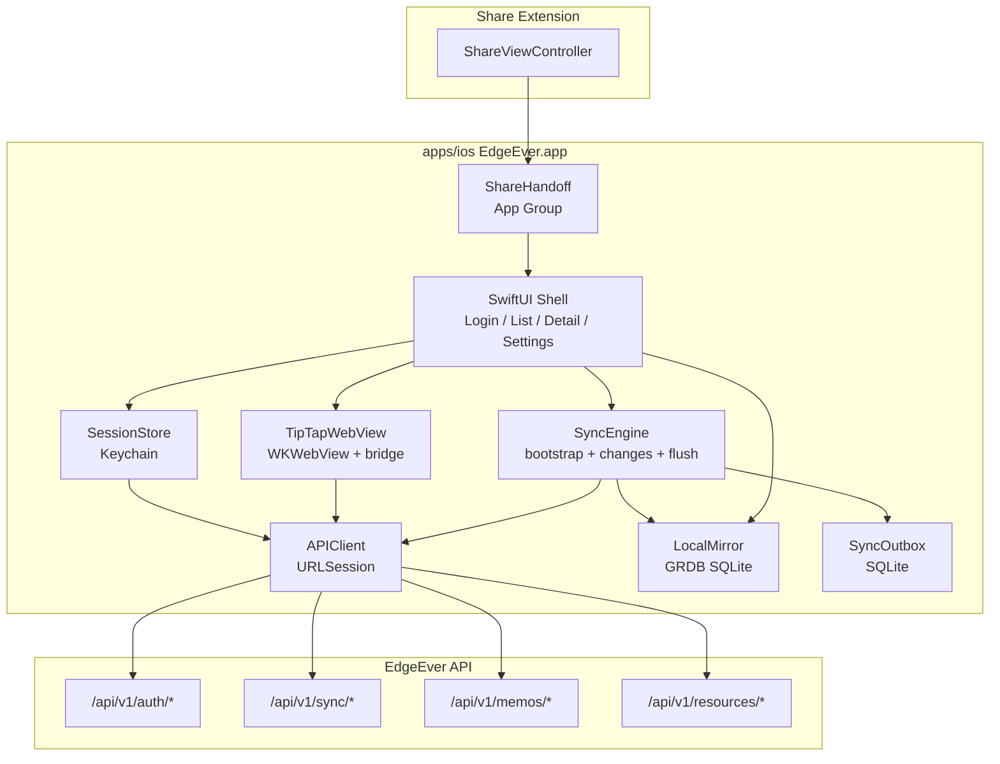
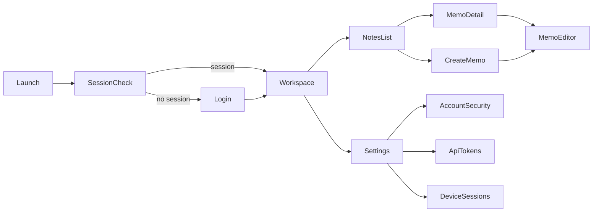
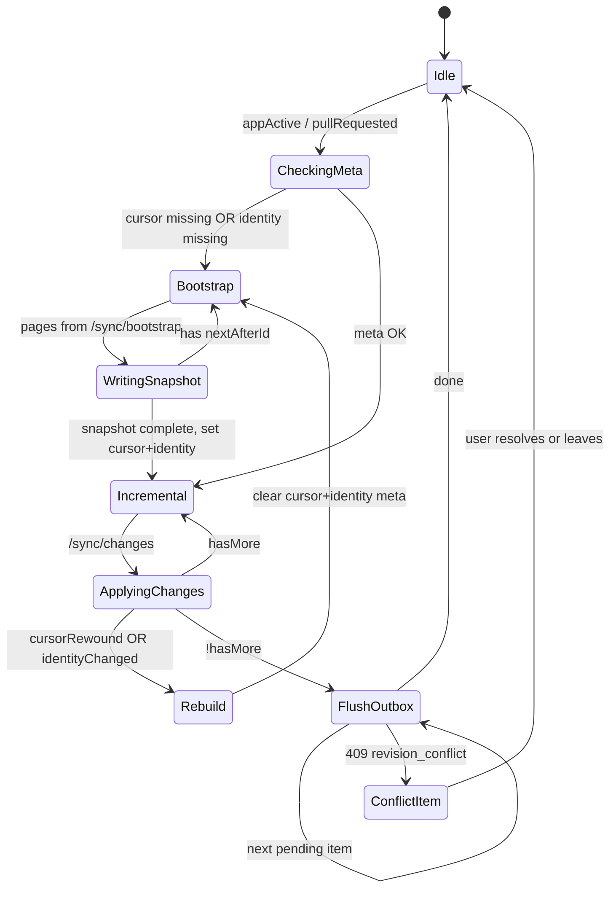
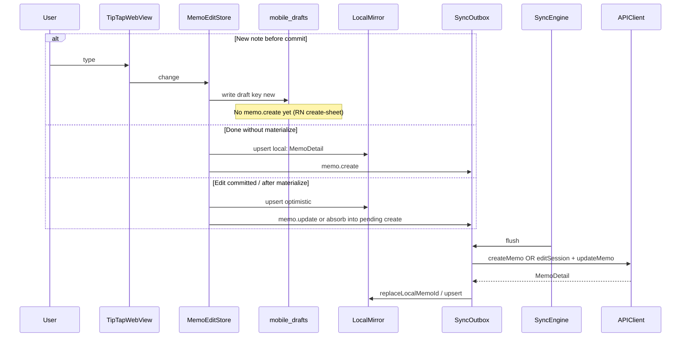

# EdgeEver iOS Swift Rewrite

| Field | Value |
| --- | --- |
| **Document** | EdgeEver iOS native rewrite (drop React Native on iOS) |
| **Author** | TBD |
| **Date** | 2026-08-06 |
| **Status** | Approved (rev 4 — design review consensus; scaffold PR 1 landed) |
| **Audience** | Senior engineers implementing `apps/ios` |
| **Related** | `docs/mobile-native-parity.md`, `apps/mobile`, `packages/client`, `packages/shared` |

---

## Overview

EdgeEver’s mobile client today is a single Expo / React Native app in `apps/mobile` targeting both Android and iOS. Android is on Google Play and is healthy. iOS has been under App Store review but fails in production with hard crashes inside React Native’s JS runtime and Fabric attributed-string paths (`EXC_BREAKPOINT` / `SIGTRAP` on `com.facebook.react.runtime.JavaScript`, malloc aborts near Hermes / AttributedString). These are not ordinary app-logic bugs; further RN crash debugging on iOS is an open-ended cost with low confidence of a durable fix.

**Product decision (final):** abandon the React Native iOS path entirely and ship a pure Swift / SwiftUI native app under `apps/ios`, keeping the same App Store listing and bundle identifier `org.edgeever.mobile`. Android remains Expo / RN in `apps/mobile`. The first App Store submission of the Swift binary **must include full editing** (login, list, sync, create/edit/autosave, offline queue, TipTap body)—not a read-only MVP.

This document specifies architecture, API surface, SQLite schema, sync state machine, TipTap WKWebView integration, save lifecycle, directory layout, acceptance criteria, migration from RN iOS, risks, key decisions, and an ordered PR / work-package plan suitable to scaffold `apps/ios` immediately after approval.

---

## Background & Motivation

### Current mobile architecture (RN)

| Layer | Location | Role |
| --- | --- | --- |
| Shell UI | `apps/mobile/src/screens/*` | Login, workspace, notes list, detail chrome, settings |
| Local mirror | `apps/mobile/src/lib/local-mirror.ts` | SQLite: notebooks, memos, sync meta, id mappings |
| Sync protocol helpers | `apps/mobile/src/lib/mobile-sync-protocol.ts` | Cursor rewind / identity change / bootstrap batching |
| Offline outbox | `apps/mobile/src/lib/sync-queue.ts` | `memo.create` / `memo.update` queue (AsyncStorage) |
| Session | `apps/mobile/src/lib/session.tsx` | SecureStore session + deviceId; Bearer token |
| API client | `packages/client/src/index.ts` | Full REST surface against `/api/v1/*` |
| Editor | `apps/mobile/src/components/LocalTiptapEditor.tsx` | TipTap in Expo DOM / WebView; shared toolbar copy in `@edgeever/shared/mobile-editor` |
| Share extension | `apps/mobile/ios/expo-sharing-extension/ShareIntoViewController.swift` | Already native Swift; App Group + open host app |
| Parity rules | `docs/mobile-native-parity.md` | Native shell for lists/nav/settings; TipTap WebView for note body; exclude ZIP import/export and trash browse from app core |

### Pain points

1. **iOS RN instability under review:** crash logs under `.tmp-app-review-crashes/` point at RN Fabric / Hermes, not EdgeEver business logic.
2. **Dual-platform RN cost on a broken half:** energy spent on iOS RN does not improve Android and blocks App Store continuity.
3. **Editor already hybrid:** TipTap is hosted in a WebView on mobile today. A native Swift shell with the same WebView document model is a smaller leap than rewriting the editor in native text views.
4. **Share extension is already Swift:** host-app rewrite can absorb and simplify the extension without Expo plugin constraints.

### Product constraints (confirmed)

- Minimum deployment target: **iOS 17** (SwiftUI-first).
- **Editing required** before first App Store submission of the Swift binary.
- Bundle ID continuity: **`org.edgeever.mobile`** (see `apps/mobile/app.json`).
- Android path: **unchanged** Expo/RN in `apps/mobile`.
- Repo policy (`AGENTS.md`): work on **`main` only** (no new git branches); bilingual docs when changing Chinese docs.
- Soft delete only on mobile (no trash browse UI); recovery remains desktop/PWA.

---

## Goals & Non-Goals

### Goals

1. Ship a store-ready native iOS app with:
   - Login to self-hosted or cloud instance (`baseUrl` + username/password + `deviceId`).
   - Notebook hierarchy browse/select + memo list (filter, sort, pin, search, soft delete); memo move-to-notebook via content outbox.
   - Local SQLite mirror + incremental sync (`/api/v1/sync/bootstrap`, `/api/v1/sync/changes`).
   - Create / rich-edit / autosave with TipTap body (same `TiptapDoc` schema as web/RN).
   - Offline create/update queue with revision conflict handling and `local:` id remap.
   - Protected resource loading (images/attachments) with Bearer token.
   - Image upload with optional compression and placeholder UX.
   - Share Extension (text / URL → open app and create draft).
   - Settings subset: locale, theme, image compression, account security (password), API tokens, device sessions, sign out.
2. Keep API contracts identical to `packages/client` (no backend fork for iOS).
3. Preserve App Store listing continuity (same bundle id, ASC app id `6792625631`).
4. Stop EAS iOS builds and RN iOS maintenance; document Android-only evolution of `apps/mobile`.
5. Structure `apps/ios` so an engineer can scaffold and implement module-by-module from this doc.

### Non-Goals (v1 submission)

- ZIP import/export, trash browse / empty trash UI.
- Multi-user **admin** UI (`listUsers` / create/disable users). RN mobile only shows the current user's role label in settings—it does **not** ship a user-management console. Do not invent one for iOS.
- Full desktop feature parity (templates library management, merge UI polish, object-storage admin).
- Replacing Android RN with Kotlin/Compose (out of scope).
- OTA JS updates on iOS (EAS Update ends for iOS; native releases only).
- Shared Swift package for Android (impossible); do **not** invent a third shared runtime.
- Offline-first for **every** mutation: content create/update always use the outbox (K6/K14); pin and soft-delete of already-synced notes remain **online-first** (match RN). Notebook **create/rename/delete** is **Deferred** (RN mobile has no CRUD UI).
- Rewriting TipTap in native Swift text views.
- Share Extension media (image/video/audio/file) in v1 (text + web URL only; intentional reduction vs current RN Share extension).

### v1 vs current RN parity matrix

Signed-off scope relative to `docs/mobile-native-parity.md` and today's `apps/mobile` implementation. **Required** = must pass store acceptance. **Deferred** = post-v1 / may land if schedule allows without blocking review. **Out of scope** = not in mobile app core.

| Capability | RN today | iOS Swift v1 |
| --- | --- | --- |
| Login + self-hosted instance | Implemented | **Required** |
| Notebook hierarchy browse + select/filter | Implemented (select/hierarchy only; **no** create/rename/delete UI—`createNotebook`/`updateNotebook`/`deleteNotebook` unused in `apps/mobile/src`) | **Required** (select/filter/tree from mirror; empty set → “请先创建一个笔记本” / create elsewhere) |
| Notebook create / rename / delete | Not in RN app UI | **Deferred** (desktop/PWA; not Gate A/B) |
| Move memo to notebook | Implemented (content path / picker) | **Required** (via memo edit notebook field + outbox `memo.update` / create payload) |
| Memo list, filter, sort, search | Implemented | **Required** |
| Pin / unpin | Implemented (online `updateMemo`) | **Required** (online-first) |
| Batch move / multi-select | Implemented | **Deferred** (single-note move OK if easy) |
| Soft delete | Implemented | **Required** |
| Local TipTap create/edit + autosave | Implemented | **Required** (gate) |
| Offline drafts + mirror + outbox | Implemented | **Required** (gate) |
| Note body viewer (TipTap) | Implemented | **Required** |
| In-note image load (Bearer) | Implemented | **Required** |
| Image upload + compression | Implemented | **Required** for App Review; **not** required for internal text-only edit gate |
| In-note attachment open / rename / delete | Implemented (`handleRenameResource` / `handleDeleteResource`) | **Required** for Gate B (body actions—not the full resource library screen) |
| Resource library screen | Implemented | **Deferred** |
| Tag management (rename/delete global tags) | Implemented | **Deferred** (tags on memo edit Required) |
| Revision history + restore | Implemented | **Deferred** (prefer include if time; not edit-gate) |
| Memo share links | Implemented | **Deferred** |
| MCP/API token management | Implemented | **Required** |
| Password change | Implemented | **Required** |
| Device sessions revoke | Implemented | **Required** |
| Multi-user admin console | Parity doc “Implemented” overstates; settings show role only | **Out of scope** |
| Share Extension text/URL | Implemented | **Required** |
| Share Extension image/video/file | Implemented in Swift extension | **Deferred** (call out in release notes) |
| ZIP import/export, trash browse | Excluded from core | **Out of scope** |
| EAS Update OTA | iOS+Android | Android only; iOS **Out of scope** |

---

## Key Decisions

| # | Decision | Rationale |
| --- | --- | --- |
| K1 | **Pure Swift / SwiftUI app in `apps/ios`; abandon RN iOS entirely** | RN Fabric/Hermes crashes are not fixable with app logic. Native shell is the product requirement for store reliability. `app.json` has `newArchEnabled: true`; crash stacks align with Fabric/Hermes, reinforcing abandon over patching. |
| K2 | **iOS 17+ only** | Unlocks modern SwiftUI navigation, Observation, and simpler concurrency without UIKit-heavy polyfills. Acceptable given crash recovery priority. |
| K3 | **Same bundle id `org.edgeever.mobile` and ASC app** | Continuity of reviews, ratings, and existing App Store Connect configuration (`eas.json` `ascAppId: 6792625631`). |
| K4 | **Editing + offline queue required before first Swift submission** | Product decision: no read-only MVP. Match RN mobile core capture loop. |
| K5 | **GRDB + SQLite local mirror with same semantic tables as RN** | Proven protocol in `local-mirror.ts`; GRDB is the mature Swift SQLite layer with migrations and observation. |
| K6 | **Committed content create/update always go through optimistic mirror + SQLite outbox; never bypass the queue for body/title/tags/notebook on the content path** | Matches RN: edits of existing memos use `localUpdateMemoMutation` (queue + mirror); first commit of a new note uses `local:` + `memo.create` or, after materialize, `memo.update`. **Uncommitted new-note composer** matches RN create-sheet: draft-only (`mobile_drafts` / `new`) until Done **or** materialize-for-image—no parallel bare `createMemo` + pending `memo.create`. Online-first is **rejected** for content saves of committed memos. |
| K24 | **At most one server create per new-note session; materialize never races outbox create** | RN `materializeMemoForImage` only runs when create-sheet has no pending `memo.create` (drafts only). iOS uses the same draft-until-commit/materialize model for new notes, plus an explicit lock algorithm if a `local:` create is already queued (see Materialize algorithm). |
| K7 | **URLSession-based API client port of `packages/client` subset** | No dependency on JS packages at runtime. Hand-port Codable models from `packages/shared/src/types.ts` + OpenAPI. |
| K8 | **Keychain for session token + deviceId; App Group `group.org.edgeever.mobile` for Share Extension** | Matches SecureStore semantics; group id already in `EdgeEver.entitlements` and share extension (confirm Apple Developer portal still matches). |
| K9 | **WKWebView hosts TipTap for viewer + editor; native chrome around it** | Same document schema (`TiptapDoc` JSON), Mermaid, tables, images as web/RN. Avoid dual editors. |
| K10 | **Editor assets: versioned static `EditorBundle` built from monorepo `EditorSource` (Vite)** | Load via `loadFileURL`. Incremental milestones (viewer → editor → resources → mermaid). Smoke-test with Vitest where feasible. No remote editor at runtime. |
| K11 | **Message bridge: typed JSON over `WKScriptMessageHandler` + `evaluateJavaScript`** | Replaces Expo DOM imperative handle (`LocalTiptapEditorRef`). |
| K12 | **Resource images: native fetch with Bearer → data URL or temp file injected into WebView** | Mirrors RN `getResourceBlob` → `blobToDataUrl` / `onLoadResource`. Do not rely on cookie sessions. |
| K13 | **Offline ids: `local:` prefix; survive bootstrap rebuild; remap via `mobile_id_mappings`** | Exact RN semantics in `local-mirror.ts` / `sync-queue.ts`. |
| K14 | **Outbox kinds v1: `memo.create`, `memo.update` only for committed content; materialize is a separate single online create (K24)** | Matches RN queue for Done/offline create and all updates. Soft delete of remote notes is online; local-only pending creates cancel queue + delete row. Pin online-first. Notebook create/rename/delete **Deferred** (not RN mobile). Materialize may call `createMemo` **only** under K24 (never while a live `memo.create` remains queued). |
| K15 | **Conflict model: revision + contentHash + edit sessions** | Flush: `createMemoEditSession` then compare `baseRevision`/`baseContentHash` to expected; mismatch → `revision_conflict` **before** PATCH. On 409 / precheck conflict, mark queue `conflict` and offer discard-local / keep draft. |
| K16 | **Android stays Expo/RN in `apps/mobile`; stop iOS EAS builds only after Swift TestFlight validates edit AC** | Ordering hazard: do not remove EAS iOS job until a Swift binary is shippable. Then CI/release scripts become Android RN + native iOS pipelines. |
| K17 | **Share Extension rewritten under `apps/ios` control** | Drop Expo sharing plugin; keep App Group payload pattern. v1 = text + web URL only. |
| K18 | **No new git branches** | `AGENTS.md`: ordered **work packages / commit series on `main`**. “PR” in this doc means logical reviewable package, **not** a mandate to open long-lived GitHub branches. |
| K19 | **Minimum TipTap feature set for store = RN mobile toolbar** | Bold, bullet list, indent, blockquote, HR, image; tables/Mermaid render; not full desktop toolbar. |
| K20 | **Markdown conversion runs inside EditorBundle only; native Swift does not reimplement markdown** | Wire format for create/update remains `contentMarkdown` (RN). Editor works in `TiptapDoc` JSON; `docToMarkdown` / `markdownToDoc` use the same TipTap Markdown extension path as `@edgeever/shared` content, validated by shared golden fixtures. Autosave payloads are markdown strings produced by the bundle (or via bridge `getMarkdown()`), not a second Swift converter. |
| K21 | **Cross-client sync contract fixtures are shared and required** | Android RN and iOS Swift both consume golden fixtures under `tests/mobile-sync-fixtures/` (or `packages/shared`); Android mirror/queue changes update fixtures in the same commit series. |
| K22 | **HTTPS default; optional user-confirmed `http://` for LAN self-host** | Match Android cleartext practicality with explicit warning; limited ATS exception + App Review notes. |
| K23 | **Freeze/remove `apps/mobile/ios` generation once Android-only prebuild is configured** | Prevent accidental EAS iOS builds from the RN tree after cutover. |

---

## Proposed Design

### High-level architecture



### Layering

| Layer | Responsibility | Tech |
| --- | --- | --- |
| **Presentation** | Navigation, lists, forms, sheets, accessibility | SwiftUI, iOS 17+ |
| **Application** | Use cases: sign-in, open memo, save draft, run sync | Actors / `@Observable` stores |
| **Domain models** | `Notebook`, `MemoDetail`, `SyncChange`, queue items | Codable structs (parity with `packages/shared`) |
| **Data** | Mirror queries, outbox mutations, preferences | GRDB, FileManager cache |
| **Network** | REST, multipart upload, blob download | URLSession |
| **Editor host** | Load TipTap bundle, bridge messages, inject resources | WKWebView |
| **Security** | Tokens, App Group, ATS | Keychain, entitlements |

### Navigation / screens (v1)



| Screen | RN source of truth | Notes |
| --- | --- | --- |
| Login | `LoginScreen.tsx` | `baseUrl`, username, password; normalize URL like `session.tsx` |
| Workspace shell | `WorkspaceScreen.tsx` | Notebook sidebar/sheet + notes stack |
| Notes list | `WorkspaceNotesView.tsx` | Search debounce 250ms; sort/filter; density |
| Memo detail (viewer) | `WorkspaceMemoDetail.tsx` | Native chrome + TipTap `mode: viewer` |
| Create / edit | create sheet + rich edit session in `WorkspaceScreen.tsx` | TipTap `mode: editor` + autosave |
| Settings | `WorkspaceSettingsView.tsx` | Locale, theme, compression, sync status, sign out |
| Account security | `AccountSecurityModal.tsx` | Change password |
| Sync conflicts | inline in workspace | Discard local / copy draft (port `discardMobileMemoConflict`) |

### Data scope

Mirror and outbox are partitioned by:

```text
scope = lowercased(trimmed baseUrl) + "|" + (userId ?? "anonymous")
```

Same as `createMobileDataScope` in `local-mirror.ts`. Signing out or switching account must not leak rows across scopes. Identity change / full rebuild clears remote rows for the scope but **preserves `id LIKE 'local:%'`** memos.

### Sync engine state machine



**Rules (match RN):**

1. Single-flight per scope (RN uses `syncPromises` map).
2. Bootstrap page size **200** (RN passes 200; `packages/client` default is 100—do not use the client default); write batches of 50.
3. Changes page size 200.
4. On rewind (`serverCursor < localCursor`) or identity mismatch: delete `cursor`+`identity` meta keys and re-bootstrap; delete non-`local:` memos; re-upsert notebooks from snapshot.
5. **Outbox flush triggers** (any of these; not only “after pull”):
   - Queue becomes non-empty after enqueue (create/update/autosave).
   - App becomes active / foreground (`scenePhase == .active`).
   - After a successful mirror pull completes (opportunistic).
   - Retry timer fires for `error` items (`nextAttemptAt`).
   - Match RN `useMobileAutomaticSync`: if already running, coalesce a follow-up run (`requestedRef` pattern).
6. Flush order: oldest `createdAt` among `pending` / `error` / `syncing` with `nextAttemptAt == null || nextAttemptAt <= now`.
7. Retry backoff: `min(5min, 2^min(attempt,6) * 1s)` — port `getSyncRetryDelayMs` from `packages/shared/src/sync.ts`.
8. Create absorbs subsequent updates for the same memo id (RN `queueMobileMemoUpdate` folds title/markdown/notebook/tags into pending `memo.create`).
9. On successful create: `replaceLocalMemoId(temporaryId, remoteMemo)` + insert id mapping; if queue version moved during flight, promote remaining create payload to `memo.update` against new id (`promoteQueuedMemoCreate`).
10. On successful update while a newer version was enqueued: rebase `expectedRevision`/`expectedContentHash` from server memo (`rebaseQueuedMemoUpdate`).
11. On successful create flush when the queue item was **removed mid-flight** (user cancelled/deleted local note): soft-delete the remote orphan (`deleteMemo(id, permanent: false)`) — RN best-effort cleanup in `syncMobileQueuedChanges`.
12. Edit-session precheck on flush of `memo.update`: after `createMemoEditSession`, if `editSession.baseRevision != expectedRevision` **or** `editSession.baseContentHash != expectedContentHash`, treat as `revision_conflict` **before** calling `updateMemo` (RN `syncMobileQueueItem`).

#### Soft delete algorithm (port `mobile-memo-delete.ts`)

For each memo id in a delete request:

1. Classify **local-only** vs **remote**:
   - Local-only if `id` starts with `local:` **or** there is a pending `memo.create` for that id.
   - Exception: if `local:` maps via `mobile_id_mappings` / `resolveLocalMemo` to a non-local remote id without pending create, treat as remote.
2. **Local-only path:** `cancelMobileMemoQueueItems` (all kinds for that memoId) → hard `DELETE` mirror row → clear draft. **No API call.**
3. **Remote path:** require online client; `deleteMemo` (single) or `deleteMemos` (batch) with `permanent: false` for ordinary mobile delete → `softDeleteLocalMemo` (set `isDeleted`/`deletedAt` on mirror) → clear draft. Permanent delete only if explicitly requested (not default UI).
4. In-flight create race: if create flush already succeeded and user deleted local-only id that was remapped, resolve mapping and soft-delete remote; if create flush completes after cancel and finds item removed, soft-delete remote orphan (rule 11).

### Editing save lifecycle

**Hard decision (K6/K14/K24):**

1. **Committed content** create/update always optimistic mirror + outbox. Online-first content save for committed memos is rejected.
2. **New-note composer** matches RN create-sheet (`WorkspaceScreen` create path): **draft-until-Done-or-materialize**—no `memo.create` and no mirror list row until the user commits (Done) **or** materializes for image upload. This prevents double server creates.
3. Direct online `updateMemo` remains reserved for **non-content** paths such as pin.

RN reference:

| Situation | RN behavior | iOS |
| --- | --- | --- |
| New note typing before Done | `writeMobileNewMemoDraft` only (~350 ms); **no** outbox | Same → `mobile_drafts` key `new` |
| Done offline / no prior materialize | `local:` + `upsertLocalMemo` + `queueMobileMemoCreate` | Same |
| Done after materialize | optimistic update + `queueMobileMemoUpdate` on **server** id | Same |
| Image on create sheet | `materializeMemoForImage` → online `createMemo` once (no pending create); then upload | Same algorithm below |
| Edit existing memo | `localUpdateMemoMutation` always outbox | Same |



**Mutation classes:**

| Class | Examples | Path |
| --- | --- | --- |
| **Uncommitted new draft** | Create-sheet typing before Done/materialize | `mobile_drafts` only—**not** outbox, **not** list row |
| **Content (outbox)** | Done on new note (`memo.create`); edits after materialize or of existing memo (`memo.update`); create-absorbs-update while `local:` pending | Optimistic mirror + outbox → flush |
| **Materialize (online create, once)** | First image on uncommitted new note | Online `createMemo` under K24 rules; then content path is `memo.update` only |
| **Online-first** | pin/unpin; soft-delete remote note | API immediately; on failure alert + keep prior UI; mirror on success |
| **Deferred online-first** | notebook create/rename/delete | Not in RN mobile UI; post-v1 if needed |
| **Local-only** | discard unsynced `local:` create or new draft | Cancel outbox if any + delete mirror/draft (no API) |

#### New-note create path (RN-aligned)

1. Require a target `notebookId` (default notebook from mirror; block if none with “请先创建一个笔记本”).
2. While composing: autosave **only** to `mobile_drafts` (`draft_key = new` for scope) at ~350 ms—**do not** allocate `local:`, **do not** enqueue `memo.create`, **do not** call `createMemo`.
3. **Done without prior materialize:**
   - Allocate `temporaryId = "local:" + base36(time) + ":" + random`.
   - Build `MemoDetail` (`revision: 0`, `contentHash: "local:" + temporaryId`, full content fields).
   - `upsertLocalMemo` + `queue memo.create` (title, contentMarkdown, notebookId, tags, createdAt).
   - Clear draft `new`. List shows the note; flush creates server row later.
4. **Done after materialize:** treat as update path on server memo id (`memo.update` outbox + mirror upsert); clear memo draft; **never** enqueue `memo.create` for that session.
5. Subsequent autosaves while `memo.create` still pending for a `local:` id **fold into** the create payload (create-absorbs-update)—never parallel `memo.update` for the same `local:` id.
6. Images: run **Materialize algorithm** (below) before upload; offline → disable image control with clear copy.

#### Materialize algorithm (at most one server create) — K24

Invariant: for a given new-note composer session / `local:` id, **exactly one** of: (a) pending or completed outbox `memo.create`, or (b) a successful online materialize `createMemo`—never both, and never two online creates.

Implement as a single actor method `materializeForImage(session)` with exclusive lock on `(scope, sessionId)`:

```text
materializeForImage(session):
  // session holds: optional localId, optional serverMemo, current editor payload

  if session.serverMemo != null:
    return session.serverMemo                    // already materialized (RN materializedMemoRef)

  if session.localId != null:
    resolved = resolveLocalMemo(scope, session.localId)
    if resolved != null AND not resolved.id.hasPrefix("local:"):
      session.serverMemo = resolved
      return resolved                            // outbox create already remapped

  require online client else throw needNetworkForImages

  with exclusiveTransaction(scope, memoKey: session.localId ?? session.draftKey):
    createItem = outbox.find(kind: memo.create, memoId: session.localId) if localId else nil

    if createItem == null AND session.localId == null:
      // RN common case: draft-only create-sheet
      response = API.createMemo(currentPayload)
      session.serverMemo = response.memo
      upsertLocalMemo(response.memo)
      clearDraft(new)
      // NO memo.create enqueued
      return response.memo

    if createItem == null AND session.localId != null:
      // Mirror row exists without outbox create (unexpected); still only one create
      response = API.createMemo(currentPayload)
      replaceLocalMemoId(session.localId, response.memo)  // or upsert + delete local + mapping
      session.serverMemo = response.memo
      session.localId = response.memo.id
      return response.memo

    if createItem.status == "syncing":
      // Create already in flight — MUST NOT call createMemo again
      await flushWaitFor(createItem)             // or wait for SyncEngine completion for this id
      resolved = resolveLocalMemo(scope, session.localId)
      if resolved == null OR resolved.id.hasPrefix("local:"):
        throw materializeFailed
      session.serverMemo = resolved
      session.localId = resolved.id
      return resolved

    if createItem.status == "pending" OR createItem.status == "error":
      // Outbox would also create — cancel first, then single online create (or wait-for-flush)
      // Preferred for image latency: cancel + online create with latest editor payload
      cancelOutboxItem(createItem)               // version-checked remove; no API
      response = API.createMemo(currentPayloadFromEditor)  // includes latest title/body/tags
      replaceLocalMemoId(session.localId, response.memo)
      session.serverMemo = response.memo
      session.localId = response.memo.id
      // Do NOT re-queue memo.create; further edits → memo.update only
      return response.memo

    if createItem.status == "conflict":
      // memo.create should not 409; surface error, do not create second memo
      throw materializeFailed
```

**Forbidden:**

- Calling `API.createMemo` while a `memo.create` for the same local id remains in outbox (`pending`/`error`/`syncing`).
- Enqueueing `memo.create` after a successful materialize for that session.
- Leaving both a remapped server row and a live `memo.create` for the old `local:` id.

**After materialize:** image upload uses `session.serverMemo.id`; editor autosave uses `memo.update` with that id’s revision/hash; Done uses update path (RN createMutation materialized branch).

**Unit tests (required for Gate B / PR 7):** draft-only materialize → one `createMemo`; materialize after Done with pending create → cancel then one `createMemo` OR wait-flush zero extra creates; materialize while `syncing` → zero extra `createMemo`; concurrent double-tap image → single create (lock).

**Update path (content) — existing or post-materialize memo:**

1. Base revision/hash from current mirror row (`resolveLocalMemo`), not stale UI-only state.
2. Optimistic upsert of title, tags, notebookId, contentJson/markdown/text/excerpt + `queue memo.update` with `expectedRevision` / `expectedContentHash` and full content fields.
3. Title, tags, and notebook changes participate in the **same** autosave/outbox path as body (not body-only).
4. Flush: `POST /memos/:id/edit-sessions` → precheck base revision/hash → `PATCH` with `editSessionId` + expectations + contentMarkdown/title/tags/notebookId.
5. Autosave debounce: **500 ms** idle after editor body change (`CHANGE_IDLE_MS`); title/tags ~**350 ms**. Force flush on `scenePhase` background / resign active (for **committed** mirror rows / outbox items; uncommitted new drafts only force-write `mobile_drafts`).

**Drafts (process death):**

- New uncommitted: `mobile_drafts` key `new` (RN `edgeever.mobile.newMemoDraft:`).
- Committed / editing existing: `mobile_drafts` key `memo:<id>` (RN `edgeever.mobile.memoDraft:`).
- On editor open, rehydrate draft if newer than mirror; clear after successful commit enqueue or discard.

### TipTap / WKWebView integration

#### Hosting model and extraction reality

`LocalTiptapEditor.tsx` is a large DOM surface (viewer + editor modes, Mermaid via `beautiful-mermaid` + mermaid, resource press/load, image upload placeholders, search/replace, toolbar active flags, `MEMO_CONTENT_STYLE`). Treat extraction as a **multi-milestone** project, not a “small Vite page.”

Ship a static package produced at monorepo build time:

```text
apps/ios/EditorSource/          # TypeScript source (Vite)
  package.json
  vite.config.ts
  src/main.ts
  src/editor.ts
  src/bridge.ts
  src/markdown.ts               # TipTap Markdown; sole doc↔md converter (K20)
  src/mermaid.ts
apps/ios/EditorBundle/          # build output committed or CI-produced
  index.html
  assets/*.js
  assets/*.css
```

Build: `Scripts/build-editor-bundle.sh` → Vite. Prefer smoke tests with Vitest on bridge message shapes and markdown round-trips using shared fixtures.

**Milestones (map to PR 6a–6d):**

| Milestone | Deliverable | Unlocks |
| --- | --- | --- |
| **6a Viewer** | Offline `setDocument` + render paragraphs/lists/quotes/tables; no network | Detail body without images |
| **6b Editor** | Toolbar, `change` events, `getMarkdown()` / doc JSON, focus/flush | **Text edit-ready gate** (with outbox PR) |
| **6c Resources** | `loadResource` bridge, placeholders, image upload hooks, resource press | Images + attachments |
| **6d Mermaid** | Mermaid render in viewer/editor | Full store body AC |

Load:

```swift
webView.loadFileURL(indexURL, allowingReadAccessTo: bundleDirectory)
```

#### Bridge protocol (typed JSON)

**Native → Web** (`evaluateJavaScript` calling `window.EdgeEverEditor.*`):

| Method | Purpose |
| --- | --- |
| `configure({ mode, locale, theme, placeholder })` | viewer vs editor |
| `setDocument(docJson)` | replace content |
| `getDocument()` | return current doc (promise via callback id) |
| `focusEnd()` | caret |
| `flush()` | force change emit |
| `exec(actionId)` | toolbar: bold, lists, etc. |
| `beginImageUpload(uploadId, previewDataUrl)` | placeholder image |
| `completeImageUpload(uploadId, imageUrl, alt)` | swap placeholder |
| `cancelImageUpload(uploadId)` | remove placeholder |
| `appendAttachment(url, filename)` | attachment link node |
| `removeResource(targetJson)` / `renameResource(...)` | resource ops |
| `search(query, index)` / `replaceAll(query, replacement)` | find |

**Web → Native** (`webkit.messageHandlers.edgeever.postMessage`):

| Event | Payload |
| --- | --- |
| `ready` | `{ startupMs }` |
| `change` | `{ contentJson, contentMarkdown }` (editor only; markdown from EditorBundle converter—K20) |
| `loadResource` | `{ requestId, source }` → native replies with data URL |
| `resourcePress` | `{ targetJson }` → native sheet: open / rename / delete (Required for store) |
| `imagePreview` | `{ alt, source }` (viewer) |
| `activeFlags` | bitfield matching `MOBILE_EDITOR_ACTIVE_FLAGS` |
| `searchResult` | `{ count, index }` |
| `log` / `error` | diagnostics |

Resource reply path: native completes `loadResource` by evaluating `EdgeEverEditor.resolveResource(requestId, dataUrlOrNull)`.

Native must **not** re-derive markdown from JSON; trust `contentMarkdown` from the bundle on `change` (or call `getMarkdown()` on flush).

#### Protected resources

1. Detect `/api/v1/resources/:id` and `/blob` variants (port `getResourceIdFromUrl` / `normalizeMobileResourceHref`).
2. `APIClient.getResourceData(path)` with `Authorization: Bearer <token>`.
3. Convert to data URL (images) or temp file URL (attachments open-in-place / share sheet).
4. Cache on disk under Application Support `resource-cache/<resourceId>` with size cap (e.g. 200 MB LRU) — port spirit of `cacheMobileResource` in `mobile-attachments.ts`.

#### Mermaid

Keep rendering **inside** the WebView (same as RN editor) to avoid dual implementations. Optional: separate lightweight mermaid renderer HTML for list previews is **not** required for v1 if list uses excerpt text only (RN list uses excerpt).

#### Image upload

1. `PHPicker` / `PhotosUI` → optional compression (max edge 2560, quality ~0.82 WebP) matching `mobile-image-upload.ts`.
2. Resolve target memo id via **Materialize algorithm (K24)**—never bare `createMemo` without outbox coordination.
3. `multipart/form-data` `POST /api/v1/memos/:id/resources` using the **single** server memo id returned by materialize.
4. Placeholder → complete with returned `resource.url`.
5. Offline or materialize failure: cancel placeholder; no second create attempts without user retry.

### Session & security

| Item | Storage | Notes |
| --- | --- | --- |
| Session JSON `{ baseUrl, token, user }` | Keychain (kSecClassGenericPassword) | Key: `org.edgeever.mobile.session` |
| `deviceId` | Keychain | `mobile-<time>-<random>`; sent on login |
| Preferences | UserDefaults or SQLite prefs table | locale, theme, density, imageCompression |
| Share payload | App Group UserDefaults | Suite: **`group.org.edgeever.mobile`** (repo entitlements; re-confirm portal matches at cutover) |

Login:

```http
POST /api/v1/auth/login
{ "username", "password", "deviceId" }
→ AuthSession { authenticated, sessionToken, user, ... }
```

Require `sessionToken` (same error message philosophy as RN if missing). All subsequent requests: `Authorization: Bearer <sessionToken>`. On 401: clear session, navigate to Login.

**ATS / cleartext (K22):** HTTPS is the default and recommended path. Users may enter `http://` for LAN self-host; show a persistent warning on the login screen. App Transport Security uses a limited exception (or `NSAllowsLocalNetworking` where applicable) documented in App Review notes. Do not silently upgrade HTTP to HTTPS.

**Info.plist usage strings (Required for store):**

- `NSPhotoLibraryUsageDescription` (or limited Photos picker strings) for image upload via PHPicker.
- Keep mic/camera strings only if WKWebView can still probe them; prefer disabling media capture in WKWebView configuration to avoid unnecessary TCC prompts.
- `ITSAppUsesNonExemptEncryption` / export compliance equivalent of RN `usesNonExemptEncryption: false`.

**Privacy Nutrition Labels:** re-audit App Store privacy answers when the binary drops Expo/RN SDKs (do not assume RN answers remain valid without review).

### Share Extension

Rewrite under `apps/ios/ShareExtension/`:

1. **v1 accept text + web URL only** (intentional reduction vs current RN extension which also handles image/video/audio/file). Document in release notes.
2. Encode payload JSON into App Group `group.org.edgeever.mobile`.
3. Open host via URL scheme `edgeever://share` (scheme already in `app.json`).
4. Host app on launch/active: read payload, clear it, open create-memo flow with prefilled markdown (title from page title if available; body link + selection text).

Do not re-use Expo plugin generated targets long-term.

### Directory structure of `apps/ios`

```text
apps/ios/
  README.md
  project.yml                    # optional XcodeGen
  EdgeEver.xcodeproj/            # or generated
  EdgeEver.xcworkspace/          # if needed
  Config/
    Debug.xcconfig
    Release.xcconfig
    Version.xcconfig             # MARKETING_VERSION, CURRENT_PROJECT_VERSION
  EdgeEver/
    App/
      EdgeEverApp.swift
      AppDelegate.swift          # if share / lifecycle hooks needed
      RootView.swift
    Features/
      Auth/
        LoginView.swift
        SessionStore.swift
      Workspace/
        WorkspaceView.swift
        NotebookListView.swift
        NotesListView.swift
        MemoDetailView.swift
        MemoEditView.swift
        SettingsView.swift
        AccountSecurityView.swift
        SyncStatusView.swift
        ConflictResolutionView.swift
      Share/
        ShareHandoffStore.swift
    Editor/
      TipTapWebView.swift
      TipTapBridge.swift
      TipTapBridgeMessages.swift
      EditorToolbarView.swift
      ResourceLoader.swift
    Data/
      Database/
        AppDatabase.swift
        Migrations.swift
        LocalMirrorRepository.swift
        SyncOutboxRepository.swift
        DraftRepository.swift
      Models/
        Notebook.swift
        Memo.swift
        SyncModels.swift
        AuthModels.swift
        ResourceModels.swift
        OutboxModels.swift
      Network/
        APIClient.swift
        APIEndpoints.swift
        APIError.swift
        MultipartFormData.swift
      Sync/
        SyncEngine.swift
        SyncProtocol.swift       # rewind/identity helpers
        OutboxFlusher.swift
      Session/
        KeychainStore.swift
        DeviceId.swift
      Preferences/
        PreferencesStore.swift
      Cache/
        ResourceCache.swift
        ImageCompressor.swift
    DesignSystem/
      Colors.swift
      Typography.swift
      Components/                # list rows, empty states, banners
    Resources/
      Assets.xcassets
      Localizable.xcstrings      # en + zh-CN
      Info.plist
      EdgeEver.entitlements
      PrivacyInfo.xcprivacy
    Supporting/
      URL+Normalize.swift
      JSONCoding.swift
  ShareExtension/
    ShareViewController.swift
    Info.plist
    ShareExtension.entitlements
  EditorBundle/                  # committed build output or generated in CI
    index.html
    assets/
  EditorSource/                  # Vite/TS source for TipTap host page
    package.json
    vite.config.ts
    src/main.ts
    src/editor.ts
    src/bridge.ts
  Tests/
    EdgeEverTests/
      LocalMirrorTests.swift
      SyncEngineTests.swift
      OutboxTests.swift
      APIClientTests.swift
      BridgeMessageTests.swift
  Scripts/
    build-editor-bundle.sh
    bump-build-number.sh
  fastlane/
    Fastfile
    Appfile
```

**SPM dependencies (recommended):**

| Package | Use |
| --- | --- |
| [GRDB.swift](https://github.com/groue/GRDB.swift) | SQLite |
| (optional) swift-markdown or none | Prefer markdown conversion in WebView/editor bundle |
| (optional) Kingfisher | Only if native image UI needs it; WebView path may not |

Avoid large UI kits; use system SwiftUI.

### CI / release implications

| Concern | Today (RN) | After rewrite |
| --- | --- | --- |
| iOS build | EAS Build from `apps/mobile` (`store-delivery.yml` ios job: `eas build --platform ios --profile production`) | **macOS runner** + `xcodebuild` archive (or Fastlane `gym`) from `apps/ios` |
| iOS submit | `eas submit` + Fastlane `submit_review` from `apps/mobile` | Upload IPA via `xcrun altool` / Transporter / Fastlane `pilot`/`deliver`; keep ASC API key submit_review from `apps/ios/fastlane` |
| Android | Unchanged local/GA builds | Unchanged (still may use `EXPO_TOKEN` for EAS Submit of AAB) |
| GitHub Release assets | macOS arm64 DMG + x64 DMG + Android arm64 APK | **Unchanged — no IPA required** on GitHub Release (AGENTS.md). iOS binary lives in App Store Connect / TestFlight only |
| Versioning | `apps/mobile/app.json` `expo.version` + EAS iOS build autoIncrement | Android: keep `expo.version` + `android.versionCode`. iOS: `apps/ios` `MARKETING_VERSION` (= release `vX.Y.Z` without `v`) + monotonic `CURRENT_PROJECT_VERSION`. **Update `AGENTS.md` release clause** when native iOS ships |
| EAS Update | iOS + Android | **Android only** |
| Store delivery | `.github/workflows/store-delivery.yml` | Split ios job off EAS; see cutover sequence below |

#### Concrete cutover (ordering matters)

1. **While building Swift:** leave EAS iOS job intact so an emergency RN build remains possible (even if crashy). Do not delete `apps/mobile/ios` yet.
2. **Ship Swift to TestFlight** (manual or temporary workflow); validate edit acceptance criteria on device.
3. **Only then** retarget automation:
   - Replace `store-delivery.yml` **ios** job:
     - `runs-on`: self-hosted macOS (or `macos-latest`) with Xcode matching project.
     - Checkout release tag → `bun run build:ios:editor` → `xcodebuild -scheme EdgeEver -configuration Release archive` → export IPA.
     - Upload to ASC with App Store Connect API key secrets already used today (`APP_STORE_CONNECT_API_KEY_*`); **drop `eas build` / `eas submit` for iOS**.
     - Move Fastlane `submit_review` working-directory from `apps/mobile` → `apps/ios`.
   - Update **`docs/store-delivery.md` + `docs/store-delivery.zh-CN.md`** in the same change (bilingual required).
   - Update **`docs/mobile-build.md`**: remove “EAS iOS production build” as the product path; document `apps/ios` archive steps. (No Chinese pair exists today for mobile-build.)
   - Update **`docs/mobile-native-parity.md`**: shell = SwiftUI on iOS / RN on Android; TipTap body both.
   - Update **`AGENTS.md`** versioning: when release includes iOS native changes, bump `apps/ios` `MARKETING_VERSION` / `CURRENT_PROJECT_VERSION` in addition to root + Android rules.
   - `apps/mobile/eas.json`: remove or comment iOS production/submit profiles; keep Android submit profiles.
   - `scripts/validate-store-delivery.mjs` / tests: if platform includes ios, validate `apps/ios` version files exist and match tag (extend tests in same series).
4. **Freeze RN iOS tree (K23):** configure Expo prebuild/Android-only so `apps/mobile/ios` is not required for Android CI; delete or stop generating `apps/mobile/ios` after one clean Android build without it.
5. **Credentials:** iOS distribution cert + provisioning profiles live in the Apple portal / CI keychain (export from EAS credentials once if needed). Android continues to need `EXPO_TOKEN` only for Play EAS Submit if still used.

**Do not** attach IPAs to formal GitHub Releases unless product later changes AGENTS asset rules.

### Cross-client contract (dual-platform maintenance)

After cutover, two clients implement the same protocol. Prevent drift:

| Artifact | Location | Owners |
| --- | --- | --- |
| Golden JSON fixtures | `tests/mobile-sync-fixtures/` (bootstrap pages, change streams, rewind, identity change, conflict edit-session mismatch, create-absorbs-update sequences) | Updated in the **same commit series** as any Android change to `local-mirror.ts` / `sync-queue.ts` / `mobile-sync-protocol.ts` |
| Behavioral checklist | Fixture-driven cases: scope key; bootstrap page sizes; `local:` survive rebuild; create-absorbs-update; promote; rebase; in-flight cancel orphan soft-delete; `getSyncRetryDelayMs` table; edit-session precheck conflict | RN: `bun test` existing + fixture loader. iOS: Swift unit tests decode same JSON |
| Markdown golden | Reuse / export cases from `packages/shared` content tests into EditorSource Vitest | Editor bundle only (K20) |
| Parity doc | `docs/mobile-native-parity.md` | Dual-shell rules; **owner: mobile platform engineer on any client change**; store release checklist includes “fixtures + both clients green” |
| CI | Ubuntu: fixture tests + RN mobile typecheck/tests. macOS (required before App Review, ideally on main for `apps/ios/**` paths): `xcodebuild test` | Optional nightly full if PR cost is high; **blocking** before store submit |

Process: Android queue/mirror PR without fixture update is incomplete. iOS outbox/mirror PR must run fixture suite. No silent protocol divergence.

### Monorepo integration notes

- Root `package.json`: add `build:ios:editor` to produce `EditorBundle`.
- Do **not** make `bun run typecheck` depend on Xcode.
- `typecheck:mobile` remains Android RN TypeScript.

---

## API / Interface Changes

**No backend API changes required for v1.** iOS consumes the existing REST surface.

### Must-have APIs (store submission)

| Client method (`packages/client`) | HTTP | iOS need |
| --- | --- | --- |
| `login` | `POST /api/v1/auth/login` | Required |
| `logout` | `POST /api/v1/auth/logout` | Required |
| `getSession` | `GET /api/v1/auth/session` | Required (validate token) |
| `changePassword` | `POST /api/v1/auth/change-password` | Required (settings) |
| `listLoginDeviceSessions` | `GET /api/v1/auth/sessions` | Required |
| `revokeLoginDeviceSession` | `DELETE /api/v1/auth/sessions/:id` | Required |
| `revokeOtherLoginDeviceSessions` | `DELETE /api/v1/auth/sessions` | Required |
| `getMobileSyncBootstrapPage` | `GET /api/v1/sync/bootstrap` | Required |
| `getMobileSyncChanges` | `GET /api/v1/sync/changes` | Required |
| `listNotebooks` | `GET /api/v1/notebooks` | Optional if bootstrap supplies notebooks; mirror is source for UI |
| `createNotebook` | `POST /api/v1/notebooks` | **Deferred** (not RN mobile UI) |
| `updateNotebook` | `PATCH /api/v1/notebooks/:id` | **Deferred** |
| `deleteNotebook` | `DELETE /api/v1/notebooks/:id` | **Deferred** |
| `createMemo` | `POST /api/v1/memos` | Required |
| `updateMemo` | `PATCH /api/v1/memos/:id` | Required |
| `getMemo` | `GET /api/v1/memos/:id` | Required (conflict discard) |
| `deleteMemo` / `deleteMemos` | `DELETE` / batch | Required |
| `createMemoEditSession` | `POST /api/v1/memos/:id/edit-sessions` | Required |
| `uploadMemoResource` | `POST /api/v1/memos/:id/resources` | Required |
| `getResourceBlob` | `GET` resource URL | Required |
| `listTags` | `GET /api/v1/tags` | Nice for filter chips; can derive from mirror |
| `listApiTokens` / `createApiToken` / `revokeApiToken` | API tokens | Required (parity table) |
| `listMemoRevisions` / `restoreMemoRevision` | Revisions | **Deferred** (not edit-gate; include if schedule allows) |
| `createMemoShare` / `getMemoShare` / `revokeMemoShare` | Share links | **Deferred** |
| `renameResource` / `deleteResource` | In-note body actions | **Required** for gate B (not full library screen) |
| `listResources` | Resource library screen | **Deferred** |
| `moveMemos` batch | Multi-select move | **Deferred** (single-note notebook change via content outbox is Required) |
| ZIP / trash empty / JSON backup | — | **Out of scope** |

### Swift client sketch

```swift
public struct EdgeEverClient: Sendable {
  public var baseURL: URL
  public var token: String?
  public var onUnauthorized: (@Sendable () -> Void)?

  public func login(_ input: LoginInput) async throws -> AuthSession
  public func logout() async throws
  public func getSession() async throws -> AuthSession

  public func getMobileSyncBootstrapPage(afterId: String?, limit: Int) async throws -> MobileSyncBootstrapPage
  public func getMobileSyncChanges(cursor: Int, limit: Int) async throws -> MobileSyncChangesPage

  public func createMemo(_ payload: CreateMemoPayload) async throws -> MemoDetail
  public func updateMemo(id: String, _ payload: UpdateMemoPayload) async throws -> MemoDetail
  public func getMemo(id: String, includeDeleted: Bool) async throws -> MemoDetail
  public func deleteMemo(id: String, permanent: Bool) async throws
  public func createMemoEditSession(memoId: String) async throws -> MemoEditSession
  public func uploadMemoResource(memoId: String, file: UploadFile) async throws -> Resource
  public func getResourceData(path: String) async throws -> Data
  // … notebooks, tags, tokens, sessions, revisions as needed
}

public struct APIError: Error, Sendable {
  public let status: Int
  public let code: String?
  public let message: String
  public var isRevisionConflict: Bool { code == "revision_conflict" || status == 409 }
}
```

Codable models must accept the same JSON field names as TS (`contentJson`, `contentMarkdown`, camelCase). Use `JSONDecoder.keyDecodingStrategy = .useDefaultKeys` with explicit `CodingKeys` matching server.

### Wire payload examples

**Create memo**

```json
{
  "notebookId": "…",
  "title": "无标题笔记",
  "contentMarkdown": "hello",
  "tags": ["a"],
  "createdAt": "2026-08-06T00:00:00.000Z",
  "updatedAt": "2026-08-06T00:00:00.000Z"
}
```

**Update memo (content)**

```json
{
  "expectedRevision": 3,
  "expectedContentHash": "…",
  "editSessionId": "…",
  "title": "…",
  "contentMarkdown": "…",
  "notebookId": "…",
  "tags": []
}
```

---

## Data Model Changes

### SQLite schema (GRDB migrations)

Database file: `edgeever-ios.sqlite` (Application Support). `PRAGMA journal_mode=WAL`.

```sql
-- Migration 1: mirror + meta (parity with local-mirror.ts)

CREATE TABLE mobile_notebooks (
  scope TEXT NOT NULL,
  id TEXT NOT NULL,
  name TEXT NOT NULL,
  sort_order INTEGER NOT NULL,
  data_json TEXT NOT NULL,
  PRIMARY KEY (scope, id)
);

CREATE TABLE mobile_memos (
  scope TEXT NOT NULL,
  id TEXT NOT NULL,
  notebook_id TEXT NOT NULL,
  title TEXT NOT NULL,
  content_text TEXT NOT NULL,
  tags_text TEXT NOT NULL,
  is_pinned INTEGER NOT NULL,
  is_deleted INTEGER NOT NULL,
  created_at TEXT NOT NULL,
  updated_at TEXT NOT NULL,
  deleted_at TEXT,
  data_json TEXT NOT NULL,
  PRIMARY KEY (scope, id)
);

CREATE INDEX idx_mobile_memos_feed
  ON mobile_memos(scope, is_deleted, updated_at DESC);
CREATE INDEX idx_mobile_memos_notebook
  ON mobile_memos(scope, notebook_id, is_deleted, updated_at DESC);
-- Note: idx_mobile_memos_search is an iOS-only optional addition (see justified differences).
-- RN uses LIKE without a dedicated search index.

CREATE TABLE mobile_sync_meta (
  scope TEXT NOT NULL,
  key TEXT NOT NULL,
  value TEXT NOT NULL,
  PRIMARY KEY (scope, key)
);

CREATE TABLE mobile_id_mappings (
  scope TEXT NOT NULL,
  temporary_id TEXT NOT NULL,
  remote_id TEXT NOT NULL,
  created_at TEXT NOT NULL,
  PRIMARY KEY (scope, temporary_id)
);

-- Migration 1 continued: outbox (improvement over AsyncStorage)

CREATE TABLE mobile_sync_outbox (
  scope TEXT NOT NULL,
  id TEXT NOT NULL,                 -- e.g. memo.create:<memoId>
  kind TEXT NOT NULL,               -- memo.create | memo.update
  memo_id TEXT NOT NULL,
  status TEXT NOT NULL,             -- pending | syncing | conflict | error
  payload_json TEXT NOT NULL,
  attempt_count INTEGER NOT NULL DEFAULT 0,
  last_error TEXT,
  next_attempt_at TEXT,
  created_at TEXT NOT NULL,
  updated_at TEXT NOT NULL,
  version INTEGER NOT NULL DEFAULT 1,
  PRIMARY KEY (scope, id)
);

CREATE INDEX idx_mobile_outbox_flush
  ON mobile_sync_outbox(scope, status, next_attempt_at, created_at);

-- Drafts

CREATE TABLE mobile_drafts (
  scope TEXT NOT NULL,
  draft_key TEXT NOT NULL,          -- memo:<id> | new
  title TEXT NOT NULL,
  content_markdown TEXT NOT NULL,
  content_json TEXT,                -- optional TipTap JSON cache
  notebook_id TEXT NOT NULL,
  tags_text TEXT NOT NULL,
  expected_revision INTEGER,        -- null for new
  updated_at TEXT NOT NULL,
  PRIMARY KEY (scope, draft_key)
);
```

### Row encoding

- `data_json` stores full `Notebook` / `MemoDetail` server shapes for forward compatibility.
- Indexed columns power list/search without parsing JSON.
- `tags_text` = tags joined by space (RN).
- Search: `LIKE %q%` on title/content_text/tags_text (RN); FTS5 optional later.

### Justified differences from RN

| Topic | RN | iOS | Why |
| --- | --- | --- | --- |
| Outbox storage | AsyncStorage JSON array | SQLite `mobile_sync_outbox` | Durability, transactional version checks |
| Drafts | AsyncStorage | SQLite `mobile_drafts` | Same |
| Search index | No dedicated index; `LIKE` on columns | Optional `idx_mobile_memos_search` (or rely on LIKE like RN) | iOS may add for large libraries; **not** claimed as RN parity—implement LIKE first |
| DB name | `edgeever-mobile.db` | `edgeever-ios.sqlite` | Platform isolation; no migration from RN local DB required |
| Preferences | AsyncStorage | UserDefaults | Simpler for flags |
| Content save path | Always outbox for content | Same (K6)—**not** a difference | Documented so implementers do not “optimize” to online-first |

**No automatic import of RN Expo SQLite files** for v1: fresh bootstrap after install/update is acceptable. Call out in release notes that offline-only unsynced RN drafts will not migrate (users should open RN build once online before upgrading if they have critical offline notes—or accept re-entry). Given RN iOS is crashing, many users may already be online-only.

### List query parity

Port `listLocalMemos` filters: notebook / multi-notebook, trash flag (always false in UI), q, filter tagged/untagged/pinned, sort updated-desc / created-desc / title-asc with pin-first, limit/offset pagination.

---

## Alternatives Considered

### A1. Keep RN iOS and only fix crashes

- **Pros:** One codebase; reuse DOM editor as-is.
- **Cons:** Crashes are in RN runtime/Fabric; unbounded timeline; App Review blocked. Repo enables React Native **New Architecture** (`newArchEnabled: true` in `app.json`); observed crash stacks (Hermes / Fabric AttributedString) align with that stack, so toggling flags or chasing community patches is unlikely to yield a durable store-quality binary on a predictable schedule.
- **Verdict:** Rejected by product decision.

### A2. Capacitor / WKWebView full PWA shell

- **Pros:** Fastest reuse of web UI.
- **Cons:** Violates `mobile-native-parity.md` (no PWA as primary workspace); performance/list feel; review risk; still not “native reliability” story.
- **Verdict:** Rejected for shell; WebView allowed **only** for TipTap body.

### A3. Kotlin Multiplatform / shared business logic

- **Pros:** Share sync engine with future Android rewrite.
- **Cons:** Large toolchain cost now; Android stays RN; delays store submission.
- **Verdict:** Deferred; keep protocol documentation so a later KMP port is possible.

### A4. Native TextKit / custom rich text instead of TipTap

- **Pros:** Fully native editor performance.
- **Cons:** Schema divergence from web; tables/Mermaid/images months of work; dual formats.
- **Verdict:** Rejected for v1; revisit only if WKWebView editor fails review/performance.

### A5. Read-only MVP then add edit

- **Pros:** Faster first binary.
- **Cons:** Explicitly forbidden by product decision; incomplete capture product.
- **Verdict:** Rejected.

---

## Security & Privacy Considerations

| Threat | Mitigation |
| --- | --- |
| Token theft from disk | Keychain accessibility `afterFirstUnlockThisDeviceOnly`; no token in logs |
| WebView XSS exfiltrating token | Do not inject token into JS; resources fetched natively; load only local editor bundle (`file://`) |
| MITM on self-hosted HTTP | HTTPS default (K22); HTTP only with explicit user entry + warning; limited ATS exception + App Review notes |
| Share Extension data leakage | App Group `group.org.edgeever.mobile` only; clear payload after consume; no password in extension |
| Screenshot of notes | Standard iOS; optional later hide in app switcher not required |
| Clipboard conflict draft | User-initiated only (parity with RN conflict copy) |
| Privacy Nutrition labels | Re-audit when binary composition changes (drop Expo/RN SDKs); do not blindly copy prior answers |
| Photo library | `NSPhotoLibraryUsageDescription` (or limited library picker) for PHPicker uploads |
| Microphone/Camera strings | Prefer disable media capture in WKWebView; add TCC strings only if still required by WebKit |

**WKWebView hardening:**

- `limitsNavigationsToAppBoundDomains` / deny unexpected navigations.
- Disable `isInspectable` in Release.
- `mediaTypesRequiringUserActionForPlayback = .all`.
- Do not enable file access outside editor bundle directory.

---

## Observability

| Signal | Approach |
| --- | --- |
| Non-fatal errors | `os.Logger` subsystems: `auth`, `sync`, `editor`, `api` |
| Sync metrics | Local counters: last bootstrap duration, last changes page count, outbox depth, conflict count |
| Sync stuck diagnosis | **Debug-only** Settings action: “Export sync diagnostics” → JSON share sheet (`scope`, cursor, identity, outbox items with status/attempt/lastError/nextAttemptAt, last pull error). No secrets/tokens in export |
| Crash reporting | Xcode Organizer / TestFlight crash reports; **first-week post-submit watch owner** named in PR 13 release checklist (default: engineer who submitted) |
| Editor bridge failures | Log event name + error string; surface “编辑器加载失败” retry UI |
| Network | Log status code + path (never Authorization header) |
| Performance targets (adapt from parity doc) | Cold launch to shell &lt; 1.0s; warm list &lt; 0.5s; list scroll without sustained dropped frames; search 250ms debounce |

No requirement for server-side new analytics endpoints.

---

## Rollout Plan

### Phase 0 — Scaffold (this design approved)

- Create `apps/ios` Xcode project, bundle id, App Group `group.org.edgeever.mobile`, URL scheme, empty SwiftUI shell.
- GRDB + Keychain + APIClient skeleton.
- Add shared fixture harness skeleton under `tests/mobile-sync-fixtures/`.
- CI: local `xcodebuild test` first; wire macOS CI when PR volume justifies (blocking before store).

### Phase 1 — Auth + mirror + list (internal)

- Login, bootstrap/incremental sync, notebooks + memos list + search + detail **viewer (6a)**.
- TestFlight internal (optional).

### Phase 2 — Edit path (required before App Review)

- **Internal edit-ready gate:** 6b editor + outbox create/update + drafts + soft delete + conflicts (text path; images optional).
- **App Review gate:** + 6c resources/images + 6d mermaid + settings + share text/URL.
- Soft delete + pin online-first.

### Phase 3 — Settings + share + polish

- Account security, tokens, sessions, locale/theme, debug diagnostics export.
- Share Extension (text/URL).
- Performance pass; accessibility; zh-CN/en-US strings.

### Phase 4 — Store submission + cutover

- Swift TestFlight validates **App Review gate** AC.
- Then remove EAS iOS job; retarget `store-delivery.yml`; update bilingual store-delivery docs + AGENTS versioning + parity doc.
- Freeze/remove `apps/mobile/ios` after Android-only prebuild works.
- First-week crash watch (Organizer/TestFlight).

### Feature flags

Not required for v1. Optional compile-time `#if DEBUG` editor debug HUD.

### Rollback

- App Store: halt release / phasable release if using phased.
- Cannot roll back users to RN binary automatically once Swift build supersedes; keep previous RN build in ASC only if still processing—do not re-submit known-crashing RN build.
- Server remains compatible with both clients during transition (Android RN + iOS Swift).

### Migration messaging

Release notes (bilingual structure per `AGENTS.md` when publishing):

- iOS app rewritten natively for stability.
- Same account/instance login.
- Local offline drafts from the previous iOS build may not carry over; ensure sync before upgrade if possible.

---

## Acceptance Criteria

Two gates. **Never cut edit-gate bullets for share/revisions/resource-library.** Images/mermaid are App Review gate, not internal text edit-ready.

### A. Internal edit-ready gate (text path — PR 8 without requiring images)

- [ ] Login with username/password against configurable `baseUrl`; persist session across relaunch.
- [ ] Invalid credentials and unreachable host show actionable errors; 401 clears session → login.
- [ ] HTTPS default; `http://` allowed with warning (K22).
- [ ] First sync bootstraps with progress; later launches incremental; cursor rewind + identity change rebuild without losing `local:` memos.
- [ ] Notes list: notebook **hierarchy browse/select/filter**, search (250 ms debounce), sort modes, pin (online-first), soft delete.
- [ ] Create requires notebook (default notebook when available); empty notebook set blocks with clear message (RN: create notebooks elsewhere / “请先创建一个笔记本”)—**no** in-app notebook create/rename/delete in v1.
- [ ] **Move memo to notebook:** change notebook on create/edit via content outbox fields (not batch `moveMemos` API).
- [ ] **New-note draft-until-commit:** typing before Done only writes `mobile_drafts` (`new`)—no list row / no `memo.create` until Done or materialize (RN create-sheet).
- [ ] **Create offline (Done without materialize):** `local:` id in list; mirror + `memo.create` outbox; sync when online; id remap without duplicate rows.
- [ ] **Create absorbs updates:** while `memo.create` pending, further title/tags/body/notebook edits update create payload only (no parallel `memo.update` for same local id).
- [ ] **Promote:** if user keeps editing during in-flight create, remaining work becomes `memo.update` on new id after create succeeds.
- [ ] **Rebase:** if user edits during in-flight update, expectations rebase from server memo after successful flush.
- [ ] **In-flight cancel:** delete pending local create cancels queue + hard-deletes local; if create already landed, remote orphan soft-deleted.
- [ ] **Edit path always outbox for committed content:** no online-first content save for body/title/tags/notebook on existing or post-materialize memos.
- [ ] **Edit-session precheck:** baseRevision/baseContentHash mismatch → conflict before PATCH.
- [ ] **Revision conflict UI:** discard local (reload server + drop queue) or keep/copy local draft.
- [ ] Title, tags, notebook, and body all autosave through the same outbox path once committed.
- [ ] Autosave debounce (500 ms body / ~350 ms title-tags); force outbox enqueue + draft persist on background for committed memos; uncommitted new notes force-write draft only.
- [ ] Process death: reopen editor restores from `mobile_drafts` when newer than mirror.
- [ ] Soft-delete algorithm matches `mobile-memo-delete.ts` (local-only vs remote).
- [ ] Viewer (6a) + editor (6b) TipTap: paragraphs, lists, quotes, tables (render); offline open works.
- [ ] Unit tests (fixtures): scope, rewind/identity, create-absorbs-update, promote, rebase, retry delay, orphan soft-delete, edit-session precheck.

### B. App Review / store-ready gate (superset of A)

- [ ] All of gate A.
- [ ] Images (auth load) + mermaid render (6c/6d).
- [ ] Image pick → compress if enabled → upload → placeholder → final URL.
- [ ] **Materialize K24:** materialize-before-image leaves **exactly one** server memo and **no** orphan pending `memo.create` for the old `local:` id; double-tap / concurrent materialize does not double-create (unit + manual).
- [ ] Offline create-sheet + image: disabled or hard failure UX; no silent partial create; no second create on retry without canceling prior outbox state.
- [ ] In-note resource open; rename/delete from body actions (API + doc update via outbox if content changes).
- [ ] Settings: theme, locale, density, image compression, sign out, change password, API tokens, device sessions; debug “export sync diagnostics.”
- [ ] Share Extension: text/URL → create draft (not image/file in v1).
- [ ] Pin works from list; soft-deleted notes hidden; no trash browser / ZIP.
- [ ] Info.plist photo library string; encryption compliance false equivalent; privacy labels re-audited.
- [ ] Manual: cold start → 50-note list → detail → edit → background → kill → relaunch recovers content; no crash.
- [ ] EAS iOS path disabled only **after** this gate on TestFlight (cutover sequence).
- [ ] Android RN still builds; GitHub Release still DMG+APK only (no IPA).

### Performance (targets)

| Path | Target |
| --- | --- |
| Cold launch → shell | &lt; 1.0 s |
| Warm launch → cached list | &lt; 0.5 s |
| Cached list usable offline | yes |
| Search keystroke | no network; 250 ms debounce |
| Editor ready | log `startupMs`; investigate if &gt; 2 s on mid-range device |

---

## Risks

| Risk | Severity | Mitigation |
| --- | --- | --- |
| TipTap bridge complexity / keyboard glitches; underestimating `LocalTiptapEditor` size | **High** | Milestones 6a–6d; text edit-ready before images; IME zh-CN tests; bridge contract tests; Vitest on EditorSource |
| Dual-platform maintenance (Swift iOS + RN Android) | **High** | **Cross-client contract** fixtures + same-commit Android fixture updates; parity doc ownership; dual green before store |
| App Review scrutiny of new binary / login to self-hosted | **Medium** | Demo instance credentials in review notes; screenshots from `store-assets` |
| Editor bundle size / JS perf | **Medium** | Tree-shake TipTap; measure; lazy mermaid (6d last) |
| Markdown conversion drift vs web | **Medium** | K20: conversion only in EditorBundle; shared golden fixtures |
| Image upload / double server create on materialize | **High** if naive | K24 + draft-until-commit create-sheet; exclusive materialize algorithm; Gate B single-memo tests; not blocking Gate A text path |
| Loss of RN local DB on upgrade | **Medium** | Release notes; encourage sync; no false promises |
| Share Extension App Group misconfig | **Medium** | Use `group.org.edgeever.mobile` from current entitlements; device test |
| Cleartext HTTP ATS rejection | **Low** | K22 warning + review notes |
| Disabling EAS iOS too early | **High** | Cutover only after Swift TestFlight validates App Review gate |
| Schedule pressure to ship read-only | **High** | Product forbids; cut share/revisions/batch/media-share before cutting edit gate A |

---

## Open Questions

1. ~~App Group id~~ → **Resolved:** `group.org.edgeever.mobile` (repo entitlements). Still verify Apple Developer portal matches at cutover.
2. **Whether App Review binary must include revision history UI** or Deferred is acceptable (design default: Deferred; not edit-gate).
3. ~~HTTP cleartext~~ → **Resolved (K22):** HTTPS default + optional user-confirmed HTTP with warning.
4. **CI macOS runner:** run `xcodebuild test` on every `apps/ios/**` change vs nightly only (blocking before store either way).
5. **Marketing version:** recommend `MARKETING_VERSION` always equals monorepo release `X.Y.Z` on store submissions; confirm in AGENTS update.
6. ~~`apps/mobile/ios` after cutover~~ → **Resolved (K23):** freeze/remove once Android-only prebuild is configured; do not leave a buildable RN iOS path after EAS iOS retirement.

---

## References

- `docs/mobile-native-parity.md` — product/architecture rules for mobile clients
- `docs/mobile-build.md` — current Expo/EAS/Android/iOS build instructions (to be updated)
- `docs/store-delivery.md` + `docs/store-delivery.zh-CN.md` — store delivery workflow (iOS path to retarget; bilingual pair must stay in sync)
- `.github/workflows/store-delivery.yml` — current EAS iOS job to replace
- `apps/mobile/src/lib/local-mirror.ts` — mirror schema + bootstrap/changes
- `apps/mobile/src/lib/sync-queue.ts` — outbox semantics
- `apps/mobile/src/lib/session.tsx` — session + deviceId + login
- `apps/mobile/src/lib/mobile-sync-protocol.ts` — rewind/identity helpers
- `apps/mobile/src/lib/mobile-memo-delete.ts` — soft delete / local-only delete
- `apps/mobile/src/lib/mobile-image-upload.ts` — compression rules
- `apps/mobile/src/components/LocalTiptapEditor.tsx` — TipTap host behavior
- `packages/client/src/index.ts` — REST client surface
- `packages/shared/src/types.ts` — `MemoDetail`, `Notebook`, auth types
- `packages/shared/src/content.ts` — `TiptapDoc`, markdown conversion
- `packages/shared/src/sync.ts` — queue summary + retry delay
- `packages/shared/src/mobile-editor.ts` — toolbar actions + i18n strings
- `apps/mobile/app.json` — bundle id, scheme, version
- `apps/mobile/eas.json` — ASC app id `6792625631`
- `apps/mobile/ios/expo-sharing-extension/ShareIntoViewController.swift` — share handoff pattern
- `docs/openapi.json` — API schema reference
- `AGENTS.md` — main-branch-only; release bilingual notes; verification commands

---

## Scaffold checklist (post-approval)

**Work on `main` only** (AGENTS.md). Each checklist item is a commit series, not a long-lived branch.

1. Create Xcode project at `apps/ios` with target `EdgeEver` (ShareExtension can wait until package 10).
2. Set deployment iOS 17, bundle `org.edgeever.mobile`, scheme `edgeever`, App Group `group.org.edgeever.mobile`.
3. Add GRDB via SPM; implement Migration 1; empty `RootView`.
4. Implement `KeychainStore` + `APIClient.login/getSession`.
5. Implement `LocalMirrorRepository` + fixture-backed unit tests + `SyncEngine` bootstrap.
6. EditorSource milestone **6a** (viewer) → then **6b** (editor).
7. Outbox + create/edit until **gate A** green (text edit-ready).
8. Resources/images/mermaid (**6c/6d**) + settings + share until **gate B** green.
9. Only then: retarget store-delivery, stop EAS iOS, freeze `apps/mobile/ios`, update AGENTS + bilingual store-delivery docs + parity doc.

**Do not mix** in one commit series: editor bundle changes + store-delivery cutover; outbox protocol + unrelated Android feature work without fixtures.

---

## PR Plan

> **Repo constraint:** `AGENTS.md` forbids new long-lived git branches. Items below are **ordered work packages / commit series on `main`**. The word “PR” means a reviewable package—not a requirement to open GitHub branches. If a human opens a short-lived PR, merge immediately.
>
> **Critical path:** 1 → 2 → 3 → 4 → 5 → 6a/6b → 8 **(gate A)** → 7/6c/6d → 9–11 → 12 cutover → 13 submit **(gate B)**.
>
> **Effort bands (rough):** S ≤ 1 day, M 2–4 days, L 5–10 days, XL &gt; 10 days for one experienced engineer.

### PR 1 — Scaffold `apps/ios` shell — **S**

- **Title:** `ios: scaffold SwiftUI app target and project layout`
- **Files/components:** `apps/ios/**` (App entry, empty RootView, xcconfig, entitlements with App Group, README)
- **Dependencies:** none
- **Do not mix:** store-delivery or Android changes
- **Description:** Xcode project, iOS 17, bundle id `org.edgeever.mobile`, URL scheme, PrivacyInfo. Placeholder UI only.

### PR 2 — Keychain session + APIClient auth — **M**

- **Title:** `ios: add Keychain session store and auth API client`
- **Files/components:** `Data/Session/*`, `Data/Network/APIClient.swift`, `LoginView`, auth models
- **Dependencies:** PR 1
- **Description:** login/logout/getSession/changePassword; URL normalize; 401 clears session; HTTP warning UI (K22).

### PR 3 — GRDB schema + local mirror + fixture harness — **M**

- **Title:** `ios: GRDB local mirror schema and list queries`
- **Files/components:** `Data/Database/*`, models, `tests/mobile-sync-fixtures/` skeleton, Swift tests for scope/list
- **Dependencies:** PR 1
- **Description:** Migrations (mirror + outbox + drafts). upsert/list/get/resolve/replaceLocalMemoId/softDelete. No search index required for parity.

### PR 4 — Sync engine (bootstrap + incremental) — **M**

- **Title:** `ios: sync engine for bootstrap and incremental changes`
- **Files/components:** `SyncEngine`, `SyncProtocol`, `/sync/*` client methods, progress UI
- **Dependencies:** PR 2, PR 3
- **Description:** Single-flight, page sizes 200/50/200, rewind/identity rebuild, preserve `local:`. Fixture tests for rewind/identity.

### PR 5 — Workspace UI: notebooks + notes list + detail chrome — **M**

- **Title:** `ios: workspace list and memo detail shell`
- **Files/components:** `Features/Workspace/*`, list rows, search debounce, pin + soft delete, notebook **tree browse/select/filter** (from mirror)
- **Dependencies:** PR 4
- **Description:** Navigation, notebook hierarchy selection (RN parity—**not** create/rename/delete), list from mirror, detail chrome. Empty notebook set messaging. Memo notebook field on edit comes with PR 8. Body can be placeholder until 6a.

### PR 6a — Editor viewer bundle — **M**

- **Title:** `ios: TipTap EditorBundle viewer mode`
- **Files/components:** `EditorSource/**` (viewer), `EditorBundle/**`, `TipTapWebView`, bridge `ready`/`setDocument`, `build-editor-bundle.sh`
- **Dependencies:** PR 1 (parallelizable with 2–5)
- **Description:** Offline render of doc JSON (paragraphs/lists/quotes/tables). No toolbar yet.

### PR 6b — Editor + toolbar + markdown change events — **L**

- **Title:** `ios: TipTap editor mode toolbar and markdown bridge`
- **Files/components:** editor mode, toolbar, `change` with `contentMarkdown` (K20), Vitest markdown fixtures
- **Dependencies:** PR 6a
- **Description:** Full text editing surface for gate A. Mermaid/images not required.

### PR 7 — Resource loading + image upload — **M** (App Review path)

- **Title:** `ios: authenticated resources and image upload`
- **Files/components:** ResourceLoader/Cache, ImageCompressor, multipart upload, PHPicker, photo usage string
- **Dependencies:** PR 2, PR 6b (ideally after 6c hooks)
- **Description:** Bearer → data URL; **Materialize algorithm K24** (single server create; unit tests for draft-only / pending create cancel / syncing wait / double-tap); compression toggle. **Not required for gate A.**

### PR 6c / 6d — Resources bridge + mermaid — **M**

- **Title:** `ios: TipTap resource bridge and mermaid`
- **Files/components:** `loadResource`, placeholders, mermaid module
- **Dependencies:** PR 6b; pairs with PR 7
- **Description:** Completes store body AC.

### PR 8 — Create/edit autosave + outbox flush + conflicts — **L** (**Gate A**)

- **Title:** `ios: memo create/edit autosave and sync outbox`
- **Files/components:** outbox repo/flusher, MemoEditView, drafts, conflict UI, soft-delete port, fixture tests (absorb/promote/rebase/orphan/precheck)
- **Dependencies:** PR 4, PR 5, **PR 6b** (not PR 7)
- **Description:** RN-aligned new-note draft-until-Done; Done → `local:` + `memo.create`; existing memo always-outbox (K6). Title/tags/body/notebook. Create-absorbs-update, promote, rebase, edit-session precheck. Force flush on background. **Internal edit-ready / text TestFlight gate.** Images/materialize explicitly out of this gate (PR 7).

### PR 9 — Settings, tokens, device sessions, i18n, diagnostics — **M**

- **Title:** `ios: settings account security tokens and localization`
- **Files/components:** Settings, preferences, `Localizable.xcstrings`, debug diagnostics export
- **Dependencies:** PR 2, PR 5
- **Description:** Locale/theme/density/compression, password, tokens, sessions, sign out, export sync diagnostics.

### PR 10 — Share Extension rewrite — **S–M**

- **Title:** `ios: native Share Extension handoff`
- **Files/components:** `ShareExtension/*`, App Group, ShareHandoffStore
- **Dependencies:** PR 5, PR 8
- **Description:** Text/URL only → create draft. Release notes note media share deferred.

### PR 11 — Polish + performance (+ optional revisions) — **M**

- **Title:** `ios: polish performance and optional revisions`
- **Files/components:** keyboard/safe area, empty states, optional revision UI
- **Dependencies:** PR 8; images/mermaid if targeting gate B
- **Description:** Launch timings; a11y; revisions only if schedule allows (Deferred).

### PR 12 — CI, parity docs, retire EAS iOS, store-delivery retarget — **M**

- **Title:** `build: native iOS pipeline and retire Expo iOS builds`
- **Files/components:**
  - `.github/workflows/store-delivery.yml` (ios job → xcodebuild/fastlane from `apps/ios`)
  - `docs/store-delivery.md` + **`docs/store-delivery.zh-CN.md`**
  - `docs/mobile-build.md`
  - `docs/mobile-native-parity.md` (SwiftUI iOS / RN Android shells)
  - `AGENTS.md` (iOS `MARKETING_VERSION` / `CURRENT_PROJECT_VERSION` on native iOS releases)
  - `apps/mobile/eas.json` (disable iOS profiles)
  - `scripts/validate-store-delivery.mjs` (+ tests) for ios version checks
  - `apps/ios/fastlane/*`
  - optional: remove/freeze `apps/mobile/ios` (K23)
- **Dependencies:** **Gate B on TestFlight** (or at least gate A + decision to keep EAS until B). **Do not** disable EAS iOS before a shippable Swift binary exists.
- **Description:** Document Android-only Expo for RN; native iOS archive/upload; GitHub Release still APK+DMG only.

### PR 13 — App Store submission package — **S–M** (**Gate B**)

- **Title:** `release: iOS Swift binary App Store submission prep`
- **Files/components:** store metadata/screenshots, review notes (demo login, native rewrite), version bumps, first-week crash-watch owner
- **Dependencies:** PR 12 + gate B checklist green
- **Description:** Archive → TestFlight → App Review. Bilingual user-facing release notes on formal monorepo release. Name crash-watch owner for first week.

---

*End of design document.*
